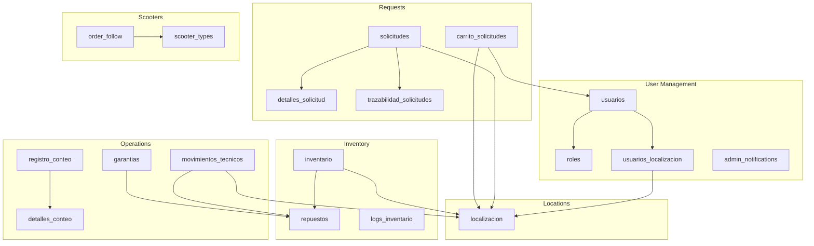
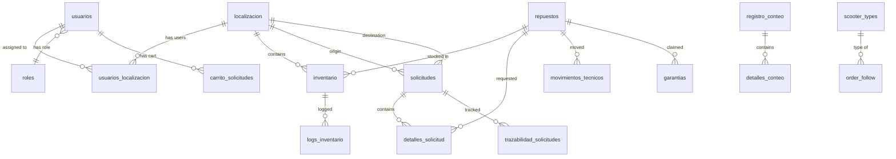

## Overview

Trazea uses a PostgreSQL database hosted on Supabase with 17 main tables organized into functional domains. The database implements Row Level Security (RLS) for multi-tenancy and role-based access control, along with triggers for automatic audit logging.

## Database Domains



## Table Schemas

### User Management Domain

#### `usuarios` (Users)

Stores user accounts with approval workflow.

| Column | Type | Description |
|--------|------|-------------|
| `id_usuario` | `uuid` | Primary key (references `auth.users`) |
| `nombre_completo` | `text` | Full name |
| `email` | `text` | Email address |
| `id_rol` | `uuid` | Foreign key to `roles` |
| `aprobado` | `boolean` | Approval status (default: `false`) |
| `aprobado_por` | `uuid` | Admin who approved (nullable) |
| `fecha_aprobacion` | `timestamptz` | Approval timestamp (nullable) |
| `motivo_rechazo` | `text` | Rejection reason (nullable) |
| `created_at` | `timestamptz` | Account creation timestamp |

**Relationships**:
- `id_rol` → `roles.id_rol`
- `aprobado_por` → `usuarios.id_usuario`
- One-to-many with `usuarios_localizacion`

**RLS Policies**:
- Users can read their own profile
- Admins can read all users
- Only admins can approve/reject users

```sql
-- Example: User approval
UPDATE usuarios
SET 
  aprobado = true,
  aprobado_por = 'admin-uuid',
  fecha_aprobacion = NOW()
WHERE id_usuario = 'user-uuid';
```

#### `roles` (Roles)

Defines user roles with granular permissions.

| Column | Type | Description |
|--------|------|-------------|
| `id_rol` | `uuid` | Primary key |
| `nombre_rol` | `text` | Role name (admin, tecnico, superuser) |
| `permisos` | `jsonb` | Permissions object |
| `created_at` | `timestamptz` | Creation timestamp |

**Permission Structure**:
```json
{
  "inventory": {
    "view": true,
    "create": true,
    "edit": true,
    "delete": false
  },
  "requests": {
    "view": true,
    "create": true,
    "approve": false
  },
  "guarantees": {
    "view": true,
    "create": true,
    "resolve": false
  },
  "users": {
    "view": false,
    "manage": false
  }
}
```

**Default Roles**:
- **admin**: Full permissions
- **superuser**: Most permissions except user management
- **tecnico**: View and create, limited edit/delete

#### `usuarios_localizacion` (User-Location Assignment)

Junction table for multi-location access.

| Column | Type | Description |
|--------|------|-------------|
| `id_usuario` | `uuid` | Foreign key to `usuarios` |
| `id_localizacion` | `uuid` | Foreign key to `localizacion` |
| `created_at` | `timestamptz` | Assignment timestamp |

**Primary Key**: `(id_usuario, id_localizacion)`

**RLS**: Users can only see data for their assigned locations.

#### `admin_notifications` (Admin Subscriptions)

Tracks admin notification preferences.

| Column | Type | Description |
|--------|------|-------------|
| `id_admin` | `uuid` | Foreign key to `usuarios` |
| `tipo_notificacion` | `text` | Notification type |
| `activo` | `boolean` | Subscription status |

### Location Domain

#### `localizacion` (Locations)

Physical locations (workshops, warehouses).

| Column | Type | Description |
|--------|------|-------------|
| `id_localizacion` | `uuid` | Primary key |
| `nombre` | `text` | Location name |
| `direccion` | `text` | Physical address |
| `telefono` | `text` | Contact phone |
| `activo` | `boolean` | Active status |
| `created_at` | `timestamptz` | Creation timestamp |

### Inventory Domain

#### `repuestos` (Spare Parts)

Centralized spare parts catalog.

| Column | Type | Description |
|--------|------|-------------|
| `id_repuesto` | `uuid` | Primary key |
| `referencia` | `text` | Unique part reference/SKU |
| `nombre` | `text` | Part name |
| `tipo` | `text` | Part type/category |
| `marca` | `text` | Brand/manufacturer |
| `descripcion` | `text` | Detailed description |
| `descontinuado` | `boolean` | Discontinued flag |
| `fecha_estimada` | `date` | Restock ETA (nullable) |
| `url_imagen` | `text` | Product image URL (nullable) |
| `created_at` | `timestamptz` | Creation timestamp |

**Indexes**:
- `referencia` (unique)
- `nombre` (text search)
- `tipo`

**Example**:
```typescript
interface Repuesto {
  id_repuesto: string
  referencia: string        // "MTR-500W-48V"
  nombre: string            // "Motor 500W 48V"
  tipo: string              // "Motor"
  marca: string             // "Bafang"
  descontinuado: boolean    // false
  fecha_estimada: string    // "2026-04-15"
  url_imagen: string        // "https://..."
}
```

#### `inventario` (Inventory)

Stock levels per location.

| Column | Type | Description |
|--------|------|-------------|
| `id_inventario` | `uuid` | Primary key |
| `id_localizacion` | `uuid` | Foreign key to `localizacion` |
| `id_repuesto` | `uuid` | Foreign key to `repuestos` |
| `stock_actual` | `integer` | Current quantity |
| `cantidad_minima` | `integer` | Minimum stock threshold |
| `posicion` | `text` | Physical location in warehouse |
| `veces_contado` | `integer` | Count audit frequency |
| `nuevo_hasta` | `timestamptz` | "New" badge expiry (nullable) |
| `created_at` | `timestamptz` | Creation timestamp |
| `updated_at` | `timestamptz` | Last update timestamp |

**Unique Constraint**: `(id_localizacion, id_repuesto)`

**Computed Fields** (via view `vista_repuestos_inventario`):
- `estado_stock`: "Critico", "Bajo", "Normal", "Alto"
- `alerta_minimo`: `stock_actual <= cantidad_minima`
- `es_nuevo`: `NOW() < nuevo_hasta`

**Triggers**:
- `log_inventory_changes`: Logs all stock modifications
- `check_low_stock`: Creates notification when stock is low

```sql
-- Example: Low stock alert
CREATE OR REPLACE FUNCTION check_low_stock()
RETURNS TRIGGER AS $$
BEGIN
  IF NEW.stock_actual <= NEW.cantidad_minima THEN
    INSERT INTO notificaciones (titulo, mensaje, tipo, prioridad)
    VALUES (
      'Stock Bajo',
      'El repuesto ' || NEW.id_repuesto || ' está en nivel crítico',
      'alerta_stock',
      'alta'
    );
  END IF;
  RETURN NEW;
END;
$$ LANGUAGE plpgsql;
```

#### `logs_inventario` (Inventory Audit Logs)

Complete audit trail for inventory changes.

| Column | Type | Description |
|--------|------|-------------|
| `id_log` | `uuid` | Primary key |
| `id_inventario` | `uuid` | Foreign key to `inventario` |
| `id_usuario` | `uuid` | User who made change |
| `tipo_operacion` | `text` | Operation type |
| `cantidad_anterior` | `integer` | Old quantity |
| `cantidad_nueva` | `integer` | New quantity |
| `diferencia` | `integer` | Change amount |
| `motivo` | `text` | Reason for change |
| `detalles` | `jsonb` | Additional context |
| `fecha` | `timestamptz` | Change timestamp |

**Operation Types**:
- `AJUSTE_MANUAL` - Manual adjustment
- `SOLICITUD_ENTRADA` - Request received
- `SOLICITUD_SALIDA` - Request dispatched
- `MOVIMIENTO_TECNICO` - Technician movement
- `CONTEO_FISICO` - Physical count adjustment
- `GARANTIA` - Warranty claim

### Request Domain

#### `carrito_solicitudes` (Request Cart)

Temporary cart for building requests.

| Column | Type | Description |
|--------|------|-------------|
| `id_item_carrito` | `uuid` | Primary key |
| `id_usuario` | `uuid` | Foreign key to `usuarios` |
| `id_localizacion` | `uuid` | Destination location |
| `id_repuesto` | `uuid` | Foreign key to `repuestos` |
| `cantidad` | `integer` | Requested quantity |
| `created_at` | `timestamptz` | Added to cart timestamp |

**Lifecycle**: Items deleted after request creation.

#### `solicitudes` (Requests)

Inter-location transfer requests.

| Column | Type | Description |
|--------|------|-------------|
| `id_solicitud` | `uuid` | Primary key |
| `id_localizacion_origen` | `uuid` | Source location |
| `id_localizacion_destino` | `uuid` | Destination location |
| `id_usuario_solicitante` | `uuid` | User who created request |
| `estado` | `text` | Current state |
| `fecha_creacion` | `timestamptz` | Creation timestamp |
| `fecha_alistamiento` | `timestamptz` | Picking completed (nullable) |
| `fecha_despacho` | `timestamptz` | Dispatched (nullable) |
| `fecha_recepcion` | `timestamptz` | Received (nullable) |
| `guia_transporte` | `text` | Shipping tracking number (nullable) |
| `observaciones_generales` | `text` | General notes (nullable) |

**States** (workflow):
1. `PENDIENTE` - Created, awaiting preparation
2. `ALISTAMIENTO` - Being picked
3. `DESPACHADO` - Shipped
4. `RECIBIDO` - Delivered
5. `CANCELADO` - Cancelled

#### `detalles_solicitud` (Request Line Items)

Individual items in a request.

| Column | Type | Description |
|--------|------|-------------|
| `id_detalle` | `uuid` | Primary key |
| `id_solicitud` | `uuid` | Foreign key to `solicitudes` |
| `id_repuesto` | `uuid` | Foreign key to `repuestos` |
| `cantidad_solicitada` | `integer` | Original request quantity |
| `cantidad_despachada` | `integer` | Actually shipped (nullable) |
| `cantidad_recibida` | `integer` | Actually received (nullable) |
| `observaciones` | `text` | Item-specific notes (nullable) |

**Discrepancy Tracking**: Differences between requested, dispatched, and received quantities are logged.

#### `trazabilidad_solicitudes` (Request Traceability)

State transition history for requests.

| Column | Type | Description |
|--------|------|-------------|
| `id_trazabilidad` | `uuid` | Primary key |
| `id_solicitud` | `uuid` | Foreign key to `solicitudes` |
| `estado_anterior` | `text` | Previous state |
| `estado_nuevo` | `text` | New state |
| `id_usuario` | `uuid` | User who made change |
| `fecha_cambio` | `timestamptz` | Change timestamp |
| `comentario` | `text` | Transition comment (nullable) |

**Trigger**: Automatically logged on `solicitudes.estado` change.

### Operations Domain

#### `movimientos_tecnicos` (Technician Movements)

Daily parts movements for technicians.

| Column | Type | Description |
|--------|------|-------------|
| `id_movimientos_tecnicos` | `uuid` | Primary key |
| `id_localizacion` | `uuid` | Foreign key to `localizacion` |
| `id_repuesto` | `uuid` | Foreign key to `repuestos` |
| `id_usuario_responsable` | `uuid` | User logging movement |
| `id_tecnico_asignado` | `uuid` | Technician assigned part |
| `concepto` | `text` | Movement concept |
| `tipo` | `text` | Movement type (ingreso/salida/venta) |
| `cantidad` | `integer` | Quantity moved |
| `numero_orden` | `integer` | Work order number (nullable) |
| `descargada` | `boolean` | Inventory deducted flag |
| `fecha` | `timestamptz` | Movement timestamp |
| `created_at` | `timestamptz` | Record creation timestamp |
| `updated_at` | `timestamptz` | Last update timestamp |

**Movement Concepts**:
- `salida` - Parts taken by technician
- `ingreso` - Parts returned
- `venta` - Parts sold
- `garantia` - Warranty replacement
- `prestamo` - Temporary loan
- `cotizacion` - Quote/estimate
- `devolucion` - Return

**Types**:
- `ingreso` - Increase stock
- `salida` - Decrease stock
- `venta` - Decrease stock (sold)

#### `garantias` (Warranties)

Warranty claims for defective parts.

| Column | Type | Description |
|--------|------|-------------|
| `id_garantia` | `uuid` | Primary key |
| `id_repuesto` | `uuid` | Foreign key to `repuestos` |
| `id_localizacion` | `uuid` | Workshop location |
| `id_usuario_reporta` | `uuid` | User who reported |
| `id_tecnico_asociado` | `uuid` | Technician involved (nullable) |
| `cantidad` | `integer` | Number of defective units |
| `motivo_falla` | `text` | Failure description |
| `kilometraje` | `integer` | Vehicle mileage (nullable) |
| `numero_orden` | `text` | Work order reference (nullable) |
| `solicitante` | `text` | Customer name (nullable) |
| `estado` | `text` | Warranty status |
| `url_evidencia_foto` | `text` | Photo evidence URL (nullable) |
| `comentarios_resolucion` | `text` | Resolution notes (nullable) |
| `fecha_reporte` | `timestamptz` | Report timestamp |
| `fecha_resolucion` | `timestamptz` | Resolution timestamp (nullable) |

**States**:
1. `SIN_ENVIAR` - Draft
2. `PENDIENTE` - Submitted, awaiting review
3. `APROBADA` - Approved by supplier
4. `RECHAZADA` - Denied by supplier

#### `registro_conteo` (Count Sessions)

Physical inventory count sessions.

| Column | Type | Description |
|--------|------|-------------|
| `id_conteo` | `uuid` | Primary key |
| `id_localizacion` | `uuid` | Foreign key to `localizacion` |
| `id_usuario` | `uuid` | User performing count |
| `fecha_conteo` | `timestamptz` | Count date |
| `total_items` | `integer` | Items counted |
| `total_diferencias` | `integer` | Discrepancies found |
| `items_con_pq` | `integer` | Items with "pequeños quedan" |
| `observaciones` | `text` | General notes (nullable) |
| `created_at` | `timestamptz` | Session creation timestamp |

**Summary Calculation**: Triggered on `detalles_conteo` insert.

#### `detalles_conteo` (Count Line Items)

Individual item counts within a session.

| Column | Type | Description |
|--------|------|-------------|
| `id_detalle_conteo` | `uuid` | Primary key |
| `id_conteo` | `uuid` | Foreign key to `registro_conteo` |
| `id_repuesto` | `uuid` | Foreign key to `repuestos` |
| `cantidad_sistema` | `integer` | System quantity |
| `cantidad_csa` | `integer` | Counted quantity at location |
| `cantidad_pq` | `integer` | "Pequeños quedan" (loose parts) |
| `diferencia` | `integer` | Calculated: `(sistema + pq) - csa` |
| `observaciones` | `text` | Item notes (nullable) |

**Trigger**: Updates `inventario.stock_actual` if difference found.

### Scooter Domain

#### `scooter_types` (Scooter Models)

Scooter model catalog.

| Column | Type | Description |
|--------|------|-------------|
| `id_tipo` | `uuid` | Primary key |
| `nombre` | `text` | Model name |
| `potencia` | `text` | Power specifications |
| `descripcion` | `text` | Model description (nullable) |

#### `order_follow` (Order Tracking)

Scooter order status tracking.

| Column | Type | Description |
|--------|------|-------------|
| `id_orden` | `uuid` | Primary key |
| `numero_orden` | `text` | Order number |
| `id_tipo_scooter` | `uuid` | Foreign key to `scooter_types` |
| `nivel` | `integer` | Progress level (1-3) |
| `estado` | `text` | Order status |
| `telefono_contacto` | `text` | Customer phone (nullable) |
| `email_contacto` | `text` | Customer email (nullable) |
| `link_orden` | `text` | External order link (nullable) |
| `fecha_orden` | `timestamptz` | Order date |
| `fecha_entrega_estimada` | `date` | ETA (nullable) |

**Levels**:
1. Ordered
2. In transit
3. Delivered

## Database Views

### `vista_repuestos_inventario`

Combined view of spare parts with inventory details.

```sql
CREATE VIEW vista_repuestos_inventario AS
SELECT 
  r.*,
  i.stock_actual,
  i.cantidad_minima,
  i.posicion,
  i.veces_contado,
  i.nuevo_hasta,
  l.nombre AS nombre_localizacion,
  CASE 
    WHEN i.stock_actual = 0 THEN 'Sin Stock'
    WHEN i.stock_actual <= i.cantidad_minima THEN 'Bajo'
    WHEN i.stock_actual <= i.cantidad_minima * 2 THEN 'Normal'
    ELSE 'Alto'
  END AS estado_stock,
  i.stock_actual <= i.cantidad_minima AS alerta_minimo,
  NOW() < i.nuevo_hasta AS es_nuevo
FROM repuestos r
LEFT JOIN inventario i ON r.id_repuesto = i.id_repuesto
LEFT JOIN localizacion l ON i.id_localizacion = l.id_localizacion;
```

## Row Level Security (RLS)

### Policies Overview

All tables have RLS enabled with policies based on:
- User authentication state
- User role
- Location assignment

### Example Policies

#### Inventory Access

```sql
-- Users can only see inventory for their assigned locations
CREATE POLICY "Users can view inventory for assigned locations"
ON inventario FOR SELECT
USING (
  id_localizacion IN (
    SELECT id_localizacion 
    FROM usuarios_localizacion 
    WHERE id_usuario = auth.uid()
  )
);

-- Admins can see all inventory
CREATE POLICY "Admins can view all inventory"
ON inventario FOR SELECT
USING (
  EXISTS (
    SELECT 1 FROM usuarios u
    JOIN roles r ON u.id_rol = r.id_rol
    WHERE u.id_usuario = auth.uid()
    AND r.nombre_rol = 'admin'
  )
);
```

#### Request Access

```sql
-- Users can view requests for their locations
CREATE POLICY "Users can view requests for assigned locations"
ON solicitudes FOR SELECT
USING (
  id_localizacion_origen IN (
    SELECT id_localizacion FROM usuarios_localizacion 
    WHERE id_usuario = auth.uid()
  )
  OR id_localizacion_destino IN (
    SELECT id_localizacion FROM usuarios_localizacion 
    WHERE id_usuario = auth.uid()
  )
);
```

## Database Diagram



## Indexing Strategy

### High-Traffic Queries

```sql
-- Inventory lookup by location
CREATE INDEX idx_inventario_localizacion 
ON inventario(id_localizacion);

-- Spare parts search
CREATE INDEX idx_repuestos_referencia 
ON repuestos(referencia);

CREATE INDEX idx_repuestos_nombre_gin 
ON repuestos USING gin(to_tsvector('spanish', nombre));

-- Request filtering
CREATE INDEX idx_solicitudes_estado 
ON solicitudes(estado);

CREATE INDEX idx_solicitudes_fecha 
ON solicitudes(fecha_creacion DESC);

-- Movement queries
CREATE INDEX idx_movimientos_tecnico 
ON movimientos_tecnicos(id_tecnico_asignado);

CREATE INDEX idx_movimientos_fecha 
ON movimientos_tecnicos(fecha DESC);
```

## Triggers

### Automatic Logging

```sql
-- Log inventory changes
CREATE TRIGGER log_inventory_changes
AFTER UPDATE OF stock_actual ON inventario
FOR EACH ROW
EXECUTE FUNCTION log_inventory_change();

-- Track request state transitions
CREATE TRIGGER track_request_state
AFTER UPDATE OF estado ON solicitudes
FOR EACH ROW
EXECUTE FUNCTION log_request_transition();

-- Update count summary
CREATE TRIGGER update_count_summary
AFTER INSERT ON detalles_conteo
FOR EACH ROW
EXECUTE FUNCTION calculate_count_summary();
```

## Migration Strategy

Supabase uses versioned migrations:

```bash
supabase/
├── migrations/
│   ├── 20260101000000_initial_schema.sql
│   ├── 20260115000000_add_warranties.sql
│   ├── 20260201000000_add_count_module.sql
│   └── ...
```

## Backup & Recovery

Supabase provides:
- **Daily automated backups** (retained 7 days)
- **Point-in-time recovery** (Pro plan)
- **Manual backups** via dashboard
- **Export to SQL** for local backups

## Performance Considerations

### Query Optimization

1. **Use views** for complex joins
2. **Index foreign keys** for fast lookups
3. **Limit result sets** with pagination
4. **Use computed columns** instead of runtime calculations
5. **Cache frequently accessed data** with TanStack Query

### Connection Pooling

Supabase uses PgBouncer for connection pooling:
- Transaction mode for web connections
- Session mode for migrations

## Related Resources

<CardGroup cols={2}>
  <Card title="Architecture Overview" icon="sitemap" href="/architecture/overview">
    System architecture overview
  </Card>
  <Card title="Security" icon="shield" href="/security/overview">
    Authentication and RLS policies
  </Card>
  <Card title="API Reference" icon="code" href="/api-reference/introduction">
    Database API usage
  </Card>
  <Card title="Data Migration" icon="database" href="/guides/data-migration">
    Import and export data
  </Card>
</CardGroup>