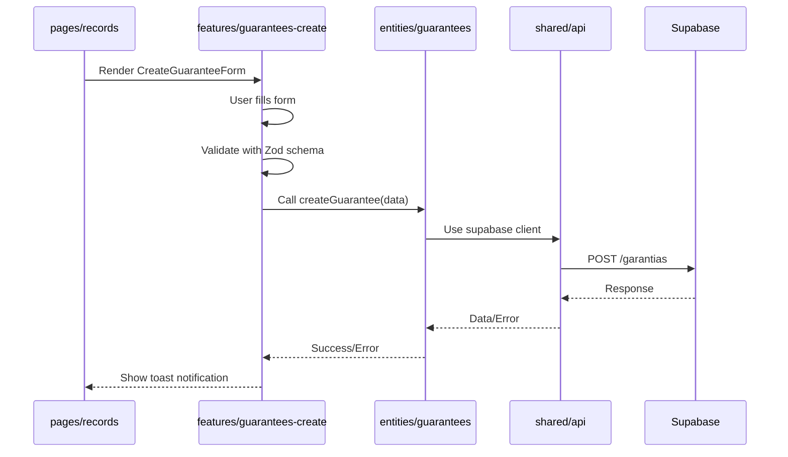

## What is Feature-Sliced Design?

Feature-Sliced Design (FSD) is an architectural methodology for frontend applications that organizes code into layers with clear responsibilities and unidirectional dependencies. It helps teams build scalable, maintainable applications by enforcing separation of concerns and preventing architectural decay.

<Info>
Learn more about FSD at [feature-sliced.design](https://feature-sliced.design/)
</Info>

## Core Principles

### 1. Layered Architecture

Code is organized into 7 standardized layers, each with a specific purpose:

```
app       → Application initialization and global configuration
pages     → Complete application routes/views
widgets   → Large composite components
features  → User scenarios and features
entities  → Business entities and domain logic
shared    → Reusable infrastructure code
```

### 2. Unidirectional Dependencies

Layers can only import from layers below them:

```
app → pages → widgets → features → entities → shared
```

<Warning>
**Forbidden**: A feature cannot import from pages or app. An entity cannot import from features.
</Warning>

### 3. Public API

Each module exposes a public API through an `index.ts` file. Internal implementation details remain private.

## Trazea's FSD Structure

### Complete Folder Hierarchy

```bash
src/
├── app/                          # Application Layer
│   ├── constants/                # Global constants
│   ├── lib/                      # Core setup (Sentry)
│   │   └── sentry.ts
│   ├── providers/                # Global providers
│   │   ├── AuthProvider.tsx      # Supabase auth context
│   │   ├── QueryProvider.tsx     # TanStack Query
│   │   └── ThemeProvider.tsx     # Dark/light mode
│   ├── styles/                   # Global styles
│   │   └── index.css             # Tailwind imports
│   └── ui/                       # App entry and routing
│       ├── App.tsx               # Main app component
│       └── Router.tsx            # Route configuration
│
├── pages/                        # Pages Layer
│   ├── auth/                     # Authentication pages
│   │   └── ui/
│   │       ├── LoginPage.tsx
│   │       ├── RegisterPage.tsx
│   │       └── PendingApprovalPage.tsx
│   ├── inventario/               # Inventory views
│   │   ├── model/                # Page-specific state
│   │   └── ui/
│   │       └── InventoryPage.tsx
│   ├── spares/                   # Spare parts catalog
│   │   ├── model/
│   │   └── ui/
│   │       └── SparesPage.tsx
│   ├── orders/                   # Scooter orders
│   │   ├── api/
│   │   ├── lib/
│   │   ├── model/
│   │   └── ui/
│   │       └── OrdersPage.tsx
│   ├── records/                  # Movement records
│   │   ├── api/
│   │   ├── lib/
│   │   ├── model/
│   │   └── ui/
│   │       └── RecordsPage.tsx
│   ├── count/                    # Physical counting
│   │   ├── api/
│   │   ├── lib/
│   │   ├── model/
│   │   └── ui/
│   │       └── CountPage.tsx
│   ├── requests/                 # Inter-location requests
│   │   └── ui/
│   │       └── RequestsPage.tsx
│   ├── dynamo/                   # Scooter tracking
│   │   ├── lib/
│   │   ├── model/
│   │   └── ui/
│   │       └── DynamoPage.tsx
│   ├── Home.tsx                  # Dashboard
│   ├── Inventory.tsx             # Main inventory
│   ├── Products.tsx              # Products view
│   └── NotFound.tsx              # 404 page
│
├── widgets/                      # Widgets Layer
│   ├── nav/                      # Navigation widget
│   │   └── ui/
│   │       ├── Sidebar.tsx       # Main sidebar
│   │       └── NavItem.tsx       # Navigation item
│   ├── notifications/            # Notification center
│   │   ├── lib/
│   │   ├── model/
│   │   │   └── notificationStore.ts
│   │   └── ui/
│   │       ├── NotificationCenter.tsx
│   │       └── NotificationItem.tsx
│   └── pagination/               # Pagination controls
│       ├── model/
│       └── ui/
│           └── Pagination.tsx
│
├── features/                     # Features Layer
│   ├── auth-login/               # Login feature
│   │   ├── lib/
│   │   │   └── authHelpers.ts
│   │   └── ui/
│   │       ├── LoginForm.tsx
│   │       └── GoogleAuthButton.tsx
│   ├── spares-create/            # Create spare parts
│   │   └── ui/
│   │       └── CreateSpareForm.tsx
│   ├── spares-upload/            # Bulk upload
│   │   ├── api/
│   │   ├── model/
│   │   │   └── uploadSchema.ts
│   │   └── ui/
│   │       └── ExcelUploader.tsx
│   ├── spares-request-workshop/  # Request workflow
│   │   ├── api/
│   │   ├── lib/
│   │   ├── model/
│   │   │   ├── cartStore.ts
│   │   │   └── requestSchema.ts
│   │   └── ui/
│   │       ├── RequestCart.tsx
│   │       ├── CartItem.tsx
│   │       └── CreateRequestDialog.tsx
│   ├── guarantees-create/        # Warranty creation
│   │   ├── api/
│   │   ├── lib/
│   │   └── ui/
│   │       └── CreateGuaranteeForm.tsx
│   ├── guarantees-dashboard/     # Warranty management
│   │   ├── lib/
│   │   ├── model/
│   │   └── ui/
│   │       ├── GuaranteesList.tsx
│   │       └── GuaranteeCard.tsx
│   ├── count-spares/             # Physical count
│   │   ├── api/
│   │   ├── model/
│   │   │   └── countSchema.ts
│   │   └── ui/
│   │       ├── CountForm.tsx
│   │       └── CountSummary.tsx
│   ├── inventory-filters/        # Advanced filtering
│   │   ├── api/
│   │   ├── lib/
│   │   ├── model/
│   │   │   └── filterStore.ts
│   │   └── ui/
│   │       └── FilterPanel.tsx
│   ├── inventario-crear-repuesto/ # Create inventory item
│   │   ├── api/
│   │   ├── model/
│   │   │   └── schemas.ts
│   │   └── ui/
│   │       └── CreateInventoryItemForm.tsx
│   ├── record-save-movement/     # Log technician movements
│   │   ├── api/
│   │   ├── constants/
│   │   ├── lib/
│   │   └── ui/
│   │       └── SaveMovementForm.tsx
│   └── requests-sended/          # Sent requests view
│       └── ui/
│           └── SendedRequestsList.tsx
│
├── entities/                     # Entities Layer
│   ├── user/                     # User entity
│   │   ├── lib/
│   │   │   └── permissions.ts
│   │   ├── model/
│   │   │   ├── types.ts
│   │   │   └── useUserStore.ts
│   │   └── ui/
│   │       ├── UserAvatar.tsx
│   │       └── UserBadge.tsx
│   ├── locations/                # Locations entity
│   │   ├── api/
│   │   │   └── locationsApi.ts
│   │   └── ui/
│   │       └── LocationSelector.tsx
│   ├── inventario/               # Inventory entity
│   │   ├── api/
│   │   │   └── inventoryApi.ts
│   │   ├── constants/
│   │   ├── lib/
│   │   │   └── inventoryHelpers.ts
│   │   ├── model/
│   │   │   ├── types.ts
│   │   │   └── hooks/
│   │   │       └── useInventory.ts
│   │   └── ui/
│   │       ├── InventoryCard.tsx
│   │       └── StockBadge.tsx
│   ├── repuestos/                # Spare parts entity
│   │   ├── api/
│   │   │   └── repuestosApi.ts
│   │   ├── constants/
│   │   ├── lib/
│   │   │   └── spareHelpers.ts
│   │   ├── model/
│   │   │   ├── types.ts
│   │   │   └── hooks/
│   │   │       └── useRepuestos.ts
│   │   └── ui/
│   ├── guarantees/               # Warranties entity
│   │   ├── api/
│   │   │   └── guaranteesApi.ts
│   │   └── model/
│   │       └── types.ts
│   ├── requests/                 # Requests entity
│   │   ├── api/
│   │   │   └── requestsApi.ts
│   │   └── model/
│   │       └── types.ts
│   ├── movimientos/              # Movements entity
│   │   ├── api/
│   │   │   └── movimientosApi.ts
│   │   ├── lib/
│   │   ├── model/
│   │   │   └── types.ts
│   │   └── ui/
│   │       └── MovementCard.tsx
│   ├── technical/                # Technician entity
│   │   ├── api/
│   │   │   └── technicalApi.ts
│   │   └── lib/
│   └── records/                  # Audit records entity
│       └── model/
│           └── types.ts
│
└── shared/                       # Shared Layer
    ├── api/                      # Shared API utilities
    │   └── supabase.ts           # Supabase client
    ├── lib/                      # Utilities
    │   ├── utils.ts              # General helpers
    │   ├── formatters.ts         # Date/number formatting
    │   └── constants.ts          # Shared constants
    ├── model/                    # Shared types
    │   └── types.ts
    └── ui/                       # Base components
        ├── button.tsx
        ├── input.tsx
        ├── dialog.tsx
        ├── badge.tsx
        ├── card.tsx
        ├── table.tsx
        ├── select.tsx
        ├── checkbox.tsx
        ├── avatar.tsx
        ├── tabs.tsx
        ├── tooltip.tsx
        └── data-table/
            ├── DataTable.tsx
            └── columns.tsx
```

## Layer Responsibilities

### App Layer (`src/app/`)

**Purpose**: Application-wide configuration and initialization

**Contains**:
- Global providers (Auth, Query, Theme)
- Routing configuration
- Supabase client setup
- Sentry error tracking setup
- Global CSS and styles
- Application constants

**Example**: `src/app/providers/AuthProvider.tsx`
```typescript
export function AuthProvider({ children }: { children: ReactNode }) {
  const [session, setSession] = useState<Session | null>(null)
  
  useEffect(() => {
    supabase.auth.getSession().then(({ data: { session } }) => {
      setSession(session)
    })
  }, [])
  
  return (
    <AuthContext.Provider value={{ session }}>
      {children}
    </AuthContext.Provider>
  )
}
```

### Pages Layer (`src/pages/`)

**Purpose**: Complete application routes that compose features and widgets

**Contains**:
- Full page components
- Page-specific routing
- Feature composition
- Layout structure

**Naming**: `*Page.tsx` suffix

**Example**: `src/pages/inventario/ui/InventoryPage.tsx`
```typescript
export function InventoryPage() {
  return (
    <div className="container">
      <Header />
      <InventoryFilters />        {/* from features */}
      <InventoryList />           {/* from features */}
      <Pagination />              {/* from widgets */}
    </div>
  )
}
```

### Widgets Layer (`src/widgets/`)

**Purpose**: Large composite components used across multiple pages

**Contains**:
- Navigation components
- Notification center
- Pagination controls
- Complex reusable UI blocks

**Example**: `src/widgets/nav/ui/Sidebar.tsx`
```typescript
export function Sidebar() {
  const { user } = useUser()        // from entities/user
  const { permissions } = useUserStore()
  
  return (
    <aside>
      <UserBadge user={user} />       {/* from entities/user */}
      <nav>
        {menuItems.map(item => (
          permissions[item.key] && <NavItem key={item.key} {...item} />
        ))}
      </nav>
    </aside>
  )
}
```

### Features Layer (`src/features/`)

**Purpose**: Complete user-facing features and use cases

**Contains**:
- Feature-specific UI components
- Business logic for the feature
- API calls specific to the feature
- Form schemas and validation
- Feature state management

**Structure**:
```
features/feature-name/
├── api/          # Feature-specific API calls
├── lib/          # Feature logic and helpers
├── model/        # Types, schemas, state
├── ui/           # Feature UI components
└── index.ts      # Public API
```

**Example**: `src/features/spares-request-workshop/`
```typescript
// model/cartStore.ts
export const useCartStore = create<CartState>((set) => ({
  items: [],
  addItem: (item) => set((state) => ({ items: [...state.items, item] })),
  removeItem: (id) => set((state) => ({ 
    items: state.items.filter(i => i.id !== id) 
  })),
}))

// ui/RequestCart.tsx
export function RequestCart() {
  const { items, removeItem } = useCartStore()
  const { createRequest } = useRequestsApi()  // from entities
  
  return (
    <Card>
      {items.map(item => (
        <CartItem key={item.id} item={item} onRemove={removeItem} />
      ))}
      <CreateRequestButton items={items} onCreate={createRequest} />
    </Card>
  )
}
```

### Entities Layer (`src/entities/`)

**Purpose**: Business entities with domain logic and data access

**Contains**:
- Entity type definitions
- API functions for entity CRUD
- Custom hooks for entity data
- Entity-specific UI components
- Domain helpers

**Structure**:
```
entities/entity-name/
├── api/          # Entity API functions
├── lib/          # Entity helpers
├── model/        # Types, hooks, stores
├── ui/           # Entity UI components
└── index.ts      # Public API
```

**Example**: `src/entities/inventario/`
```typescript
// model/types.ts
export interface InventoryItem {
  id_inventario: string
  id_localizacion: string
  id_repuesto: string
  stock_actual: number
  posicion: string
  cantidad_minima: number
  estado_stock: string
}

// api/inventoryApi.ts
export async function getInventoryItems(params: InventoryParams) {
  const { data, error } = await supabase
    .from('inventario')
    .select('*')
    .eq('id_localizacion', params.locationId)
  
  if (error) throw error
  return data
}

// model/hooks/useInventory.ts
export function useInventory(locationId: string) {
  return useQuery({
    queryKey: ['inventory', locationId],
    queryFn: () => getInventoryItems({ locationId }),
  })
}
```

### Shared Layer (`src/shared/`)

**Purpose**: Reusable infrastructure code with no business logic

**Contains**:
- UI primitives (buttons, inputs, dialogs)
- Utility functions
- Common types
- Formatters and validators
- API client setup

**Example**: `src/shared/ui/button.tsx`
```typescript
export function Button({ children, variant = 'default', ...props }: ButtonProps) {
  return (
    <button
      className={cn(
        'px-4 py-2 rounded-md',
        variant === 'primary' && 'bg-blue-600 text-white',
        variant === 'secondary' && 'bg-gray-200 text-gray-900'
      )}
      {...props}
    >
      {children}
    </button>
  )
}
```

## Feature Internal Structure

Each feature follows a consistent internal structure:

### `/api` - API Integration

API calls specific to this feature.

```typescript
// features/count-spares/api/countApi.ts
export async function submitCount(countData: CountSubmission) {
  const { data, error } = await supabase
    .from('registro_conteo')
    .insert(countData)
  
  if (error) throw error
  return data
}
```

### `/lib` - Business Logic

Feature-specific helpers and utilities.

```typescript
// features/count-spares/lib/countHelpers.ts
export function calculateDifference(
  systemQty: number,
  countedQty: number,
  pqQty: number
): number {
  return (systemQty + pqQty) - countedQty
}
```

### `/model` - Data Models

Types, schemas, and state management.

```typescript
// features/count-spares/model/countSchema.ts
import { z } from 'zod'

export const countItemSchema = z.object({
  id_repuesto: z.string().uuid(),
  cantidad_sistema: z.number().int().min(0),
  cantidad_csa: z.number().int().min(0),
  cantidad_pq: z.number().int().min(0),
})

export type CountItem = z.infer<typeof countItemSchema>
```

### `/ui` - User Interface

React components for the feature.

```typescript
// features/count-spares/ui/CountForm.tsx
export function CountForm({ locationId }: CountFormProps) {
  const form = useForm<CountItem>({
    resolver: zodResolver(countItemSchema)
  })
  
  const { mutate: submitCount } = useMutation({
    mutationFn: submitCount,
  })
  
  return (
    <Form {...form}>
      <FormField name="cantidad_sistema" />
      <FormField name="cantidad_csa" />
      <FormField name="cantidad_pq" />
      <Button type="submit">Submit Count</Button>
    </Form>
  )
}
```

## Data Flow Through Layers

### Example: Creating a Warranty



## Best Practices

### 1. Keep Layers Pure

<Check>
**Good**: Feature imports from entities
```typescript
// features/spares-create/ui/CreateSpareForm.tsx
import { useRepuestos } from '@/entities/repuestos'
import { Button } from '@/shared/ui/button'
```
</Check>

<Warning>
**Bad**: Entity imports from features
```typescript
// entities/repuestos/api/repuestosApi.ts
import { createSpareSchema } from '@/features/spares-create/model' // ❌
```
</Warning>

### 2. Use Public APIs

Every segment exports through `index.ts`:

```typescript
// features/spares-create/index.ts
export { CreateSpareForm } from './ui/CreateSpareForm'
export { createSpareSchema } from './model/schemas'
export type { CreateSpareData } from './model/types'
```

Other modules import from the public API:

```typescript
// pages/spares/ui/SparesPage.tsx
import { CreateSpareForm } from '@/features/spares-create'
```

### 3. Colocate Related Code

Keep types, components, and logic for a feature together:

```
features/spares-request-workshop/
├── model/
│   ├── types.ts         # Request types
│   ├── cartStore.ts     # Cart state
│   └── schemas.ts       # Validation schemas
├── ui/
│   ├── RequestCart.tsx  # Uses cartStore
│   └── CartItem.tsx     # Uses types
└── api/
    └── requestApi.ts    # Uses types
```

### 4. Single Responsibility

Each feature should handle one user scenario:

- `spares-create` - Creating spare parts
- `spares-upload` - Bulk uploading spare parts
- `spares-request-workshop` - Requesting spare parts

Don't mix multiple scenarios in one feature.

## Migration Guide

If you need to refactor existing code to FSD:

### Step 1: Identify the Layer

Is it:
- A complete page? → `pages`
- A reusable composite? → `widgets`
- A user feature? → `features`
- A business entity? → `entities`
- Infrastructure code? → `shared`

### Step 2: Create the Structure

```bash
mkdir -p src/features/my-feature/{ui,model,api,lib}
touch src/features/my-feature/index.ts
```

### Step 3: Move Files

Move components to `ui/`, types to `model/`, etc.

### Step 4: Update Imports

Change absolute imports to use the FSD structure:

```typescript
// Before
import { MyComponent } from '../../components/MyComponent'

// After
import { MyComponent } from '@/features/my-feature'
```

### Step 5: Export Public API

```typescript
// src/features/my-feature/index.ts
export { MyComponent } from './ui/MyComponent'
export type { MyData } from './model/types'
```

## Benefits of FSD in Trazea

### 1. Scalability
- Easy to add new features without affecting existing code
- Clear boundaries prevent feature entanglement
- New team members understand structure immediately

### 2. Maintainability
- Related code is colocated
- Dependency direction is enforced
- Refactoring is safer with clear boundaries

### 3. Testability
- Each layer can be tested independently
- Mock dependencies from lower layers
- Unit test features in isolation

### 4. Collaboration
- Multiple developers can work on different features
- Merge conflicts reduced
- Code reviews are more focused

## Related Resources

<CardGroup cols={2}>
  <Card title="Architecture Overview" icon="sitemap" href="/architecture/overview">
    High-level system architecture
  </Card>
  <Card title="Tech Stack" icon="layer-group" href="/architecture/tech-stack">
    Technologies and tools used
  </Card>
  <Card title="Database Model" icon="database" href="/architecture/database-model">
    Database schema and relationships
  </Card>
  <Card title="Feature Development" icon="code" href="/development/creating-features">
    How to create new features
  </Card>
</CardGroup>