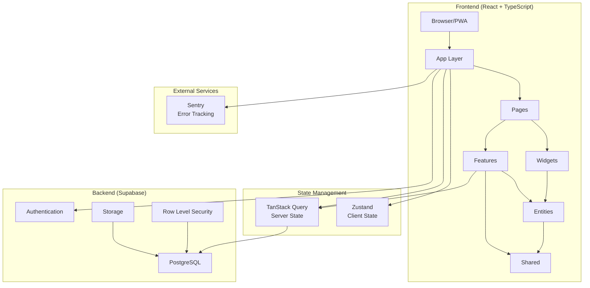
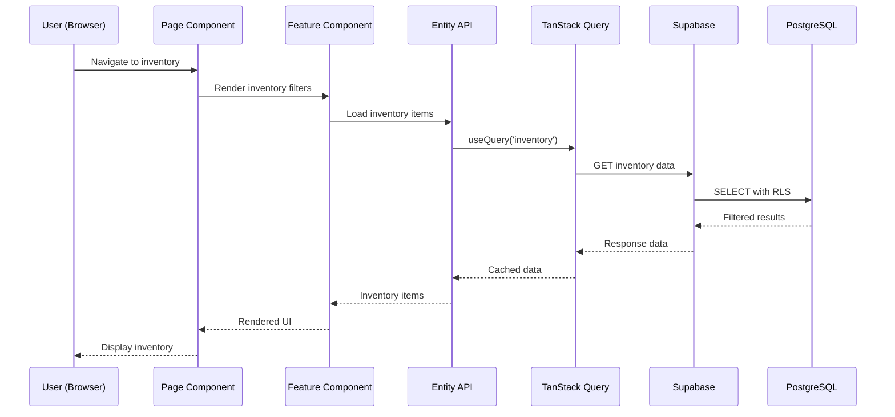

## Overview

Trazea is built on a modern, scalable architecture that combines **Feature-Sliced Design (FSD)** methodology with a powerful tech stack centered around React, TypeScript, and Supabase. The architecture is designed to support complex workflows including multi-location inventory management, request tracking, warranty management, and technician movements.

## Architectural Principles

### 1. Feature-Sliced Design (FSD)

The codebase follows FSD methodology, organizing code into layers with clear responsibilities and unidirectional dependencies:

```
app → pages → widgets → features → entities → shared
```

Each layer can only depend on layers below it, ensuring a clean dependency graph and preventing circular dependencies.

### 2. Separation of Concerns

- **UI Layer**: React components focused purely on presentation
- **Business Logic**: Separated into feature-specific logic and shared utilities
- **Data Layer**: Supabase handles authentication, database, storage, and real-time subscriptions
- **State Management**: Client state (Zustand) vs. Server state (TanStack Query)

### 3. Type Safety

TypeScript is used throughout with strict mode enabled, providing:
- Compile-time error detection
- Enhanced IDE autocomplete and refactoring
- Self-documenting code through interfaces and types
- Type inference with Zod schema validation

## System Architecture



## Core Components

### Frontend Architecture

#### App Layer (`src/app/`)
The application foundation containing:
- **Providers**: Authentication, React Query, Theme providers
- **Routing**: Main application routing configuration
- **Global Configuration**: Supabase client, Sentry setup
- **Styles**: Global CSS and Tailwind configuration

#### Pages Layer (`src/pages/`)
Complete application views that compose features and widgets:
- **auth**: Login, registration, approval flow
- **inventario**: Multi-location inventory management
- **spares**: Spare parts catalog
- **orders**: Scooter order tracking
- **records**: Movement history and logs
- **count**: Physical inventory counting
- **requests**: Inter-location request management
- **dynamo**: Scooter-specific functionality

#### Widgets Layer (`src/widgets/`)
Reusable composite components:
- **nav**: Sidebar navigation and main menu
- **notifications**: In-app notification center
- **pagination**: Generic pagination controls

#### Features Layer (`src/features/`)
User-facing functionality modules:
- **auth-login**: Authentication flows (email + Google OAuth)
- **spares-create**: Spare parts CRUD operations
- **spares-upload**: Bulk Excel import
- **spares-request-workshop**: Request workflow with cart
- **guarantees-create**: Warranty registration
- **guarantees-dashboard**: Warranty management
- **count-spares**: Physical count auditing
- **inventory-filters**: Advanced search and filtering
- **record-save-movement**: Technician movement logging

#### Entities Layer (`src/entities/`)
Domain models and business logic:
- **user**: Authentication, roles, permissions
- **locations**: Multi-location management
- **inventario**: Inventory items and stock
- **repuestos**: Spare parts catalog
- **guarantees**: Warranty management
- **requests**: Request workflow
- **movimientos**: Technician movements
- **technical**: Technician data
- **records**: Audit logs and history

#### Shared Layer (`src/shared/`)
Reusable foundation:
- **ui**: Base components (buttons, inputs, dialogs, badges)
- **lib**: Utilities, formatters, helpers
- **model**: Common types and interfaces
- **api**: Shared API utilities

### Backend Architecture (Supabase)

Supabase provides a complete backend-as-a-service:

#### PostgreSQL Database
- **17 main tables** organized by domain
- **Views** for complex queries (e.g., `vista_repuestos_inventario`)
- **Triggers** for automatic logging and notifications
- **Functions** for business logic and data transformations

#### Authentication
- Email/password authentication
- Google OAuth integration
- User approval workflow
- Role-based access control (RBAC)

#### Row Level Security (RLS)
All tables implement RLS policies to ensure:
- Users only access data for their assigned locations
- Role-based data filtering
- Automatic multi-tenancy support
- Protection against unauthorized access

#### Storage
- Product images for spare parts
- Warranty evidence photos
- User avatars
- Excel import files

## Data Flow

### Request Flow Example



### State Management Flow

**Client State (Zustand)**:
- UI state (modals, filters, selections)
- User preferences
- Form data (before submission)
- Local-only state

**Server State (TanStack Query)**:
- Database records
- API responses
- Cached data with automatic revalidation
- Background refetching

## Security Architecture

### Authentication Flow

1. User logs in via email/password or Google OAuth
2. Supabase validates credentials and issues JWT
3. JWT stored in httpOnly cookie
4. All API requests include JWT in Authorization header
5. Supabase validates JWT on every request
6. Row Level Security filters data based on user context

### Authorization

- **Role-based permissions**: Stored as JSON in `roles` table
- **Multi-location access**: Via `usuarios_localizacion` junction table
- **Granular permissions**: Each feature checks specific permissions
- **Admin approval**: New users require admin approval before access

### Data Protection

- All communication over HTTPS
- Row Level Security on all tables
- Input validation with Zod schemas
- SQL injection prevention via parameterized queries
- XSS protection via React's automatic escaping

## Monitoring & Error Tracking

### Sentry Integration

**Version**: 10.26.0

**Capabilities**:
- Automatic error capture in production
- Stack traces with source maps
- User context (ID, email, role)
- Breadcrumbs for debugging
- Performance monitoring
- Release tracking

**Configuration**: `src/app/lib/sentry.ts`

## Build & Development

### Build System

**Vite 7.2.2** (Rolldown variant) provides:
- Lightning-fast Hot Module Replacement (HMR)
- Optimized production builds
- Code splitting and lazy loading
- Tree shaking for minimal bundle size
- CSS optimization

### Development Workflow

1. **Development**: `pnpm dev` - Local server with HMR
2. **Type Checking**: `tsc -b` - TypeScript compilation
3. **Linting**: `eslint .` - Code quality checks
4. **Building**: `pnpm build` - Production-ready bundle
5. **Preview**: `pnpm preview` - Test production build locally

## Progressive Web App (PWA)

Trazea is built as a PWA using `vite-plugin-pwa`, providing:
- Offline capability
- Install to home screen
- App-like experience on mobile
- Service worker for caching
- Push notifications (planned)

## Scalability Considerations

### Frontend Scalability
- **Code splitting**: Each page lazy-loaded
- **Component lazy loading**: Heavy components loaded on demand
- **Virtual scrolling**: For large lists
- **Debounced search**: Reduced API calls
- **Pagination**: Limited data fetching

### Backend Scalability
- **Database indexing**: On frequently queried columns
- **Query optimization**: Using views for complex joins
- **Connection pooling**: Managed by Supabase
- **CDN for assets**: Static files served via CDN
- **Caching strategy**: TanStack Query cache + Supabase cache

## Deployment Architecture

### Production Environment

- **Hosting**: Vercel (recommended) or Docker
- **Database**: Supabase managed PostgreSQL
- **CDN**: Automatic via Vercel Edge Network
- **SSL**: Automatic HTTPS
- **Environment**: Isolated production database

### CI/CD Pipeline

1. Push to `main` branch
2. Vercel automatically triggers build
3. Run TypeScript compilation
4. Run linting checks
5. Build production bundle
6. Deploy to Vercel Edge Network
7. Sentry release tracking

## Next Steps

<CardGroup cols={2}>
  <Card title="Feature-Sliced Design" icon="layer-group" href="/architecture/feature-sliced-design">
    Detailed FSD implementation and folder structure
  </Card>
  <Card title="Tech Stack" icon="layer-group" href="/architecture/tech-stack">
    Technologies, versions, and rationale
  </Card>
  <Card title="Database Model" icon="database" href="/architecture/database-model">
    Complete database schema and relationships
  </Card>
  <Card title="Security" icon="shield" href="/security/overview">
    Authentication, authorization, and RLS
  </Card>
</CardGroup>