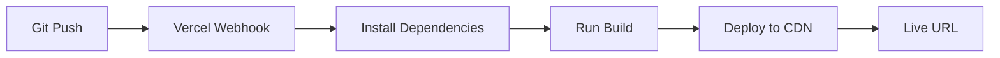

## Overview

Vercel is the recommended platform for deploying Trazea. It provides:
- Automatic deployments on every git push
- Built-in CI/CD pipeline
- Global CDN for fast content delivery
- Zero-configuration SPA routing
- Environment variable management

## Prerequisites

<Check>
  - GitHub, GitLab, or Bitbucket repository with Trazea code
  - [Vercel account](https://vercel.com/signup) (free tier available)
  - Supabase project configured (see [Supabase Configuration](/deployment/supabase-configuration))
</Check>

## Quick Deploy

### 1. Connect Repository

1. Go to [Vercel Dashboard](https://vercel.com/dashboard)
2. Click **Add New > Project**
3. Import your Trazea repository
4. Vercel will auto-detect the Vite framework

### 2. Configure Build Settings

Vercel automatically detects Vite projects. Verify these settings:

<ParamField path="Framework Preset" type="string" default="Vite">
  Should be automatically detected as **Vite**
</ParamField>

<ParamField path="Build Command" type="string" default="pnpm build">
  ```bash
  pnpm build
  ```
</ParamField>

<ParamField path="Output Directory" type="string" default="dist">
  ```bash
  dist
  ```
</ParamField>

<ParamField path="Install Command" type="string" default="pnpm install">
  ```bash
  pnpm install
  ```
</ParamField>

### 3. Add Environment Variables

In the Vercel project settings, add all required environment variables:

<Steps>
  <Step title="Navigate to Environment Variables">
    Go to **Project Settings > Environment Variables**
  </Step>
  
  <Step title="Add Supabase Variables">
    Add the following variables:
    
    ```bash
    VITE_SUPABASE_URL=https://your-project.supabase.co
    VITE_SUPABASE_ANON_KEY=your-anon-key
    ```
  </Step>
  
  <Step title="Add Sentry DSN (Optional)">
    For production error tracking:
    
    ```bash
    VITE_SENTRY_DSN=https://your-dsn@sentry.io/project-id
    ```
  </Step>
  
  <Step title="Add ElevenLabs Key (Optional)">
    If using voice agent features:
    
    ```bash
    VITE_PUBLIC_ELEVENLABS_API_KEY=your-api-key
    ```
  </Step>
  
  <Step title="Set Environment Scope">
    Select **Production**, **Preview**, and **Development** as needed
  </Step>
</Steps>

### 4. Deploy

Click **Deploy** and Vercel will:
1. Install dependencies with `pnpm install`
2. Build the project with `pnpm build`
3. Deploy to global CDN
4. Provide a production URL (e.g., `trazea.vercel.app`)

<Success>
  Your first deployment is live! Future pushes to your main branch will automatically trigger new deployments.
</Success>

## Vercel Configuration

Trazea includes a `vercel.json` configuration file for proper SPA routing:

```json vercel.json
{
  "rewrites": [
    {
      "source": "/(.*)",
      "destination": "/"
    }
  ]
}
```

### What This Does

This configuration ensures that all routes (e.g., `/inventario`, `/spares`, `/orders`) are rewritten to `/index.html`, allowing React Router to handle client-side routing.

<Info>
  Without this configuration, direct navigation to routes like `/inventario` would result in a 404 error.
</Info>

## Custom Domain

To use a custom domain:

<Steps>
  <Step title="Add Domain">
    Go to **Project Settings > Domains**
  </Step>
  
  <Step title="Enter Your Domain">
    Add your domain (e.g., `trazea.example.com`)
  </Step>
  
  <Step title="Configure DNS">
    Add the provided DNS records to your domain registrar:
    
    ```bash
    # A Record
    A    @    76.76.21.21
    
    # CNAME Record (for subdomains)
    CNAME    www    cname.vercel-dns.com
    ```
  </Step>
  
  <Step title="Wait for SSL">
    Vercel automatically provisions SSL certificates via Let's Encrypt
  </Step>
</Steps>

## Automatic Deployments

### Branch Deployments

Vercel creates preview deployments for every branch:

- **Production**: `main` or `master` branch → production domain
- **Preview**: All other branches → unique preview URL
- **PR Comments**: Vercel bot comments on pull requests with preview URLs

### Deployment Flow



## Environment-Specific Variables

Configure different values per environment:

<CodeGroup>

```bash Production
# Production Supabase project
VITE_SUPABASE_URL=https://prod-project.supabase.co
VITE_SUPABASE_ANON_KEY=prod-anon-key
VITE_SENTRY_DSN=https://prod-dsn@sentry.io/123
```

```bash Preview
# Staging Supabase project for preview deployments
VITE_SUPABASE_URL=https://staging-project.supabase.co
VITE_SUPABASE_ANON_KEY=staging-anon-key
VITE_SENTRY_DSN=https://staging-dsn@sentry.io/456
```

```bash Development
# Local development Supabase project
VITE_SUPABASE_URL=https://dev-project.supabase.co
VITE_SUPABASE_ANON_KEY=dev-anon-key
```

</CodeGroup>

## Build Optimization

Trazea's Vite configuration includes production optimizations:

```typescript vite.config.ts
build: {
  chunkSizeWarningLimit: 1000,
  rollupOptions: {
    output: {
      manualChunks(id) {
        if (id.includes('node_modules')) {
          if (id.includes('react') || id.includes('react-dom')) {
            return 'react-vendor';     // React core bundle
          }
          if (id.includes('@supabase')) {
            return 'supabase-vendor';  // Supabase client bundle
          }
          if (id.includes('@radix-ui') || id.includes('lucide-react')) {
            return 'ui-vendor';        // UI library bundle
          }
          return 'vendor';             // Other dependencies
        }
      },
    },
  },
}
```

This creates optimized code-split bundles:
- **react-vendor.js**: React and React Router (~150 KB)
- **supabase-vendor.js**: Supabase client (~180 KB)
- **ui-vendor.js**: Radix UI and Lucide icons (~120 KB)
- **vendor.js**: Other dependencies (~200 KB)

## Monitoring

### Vercel Analytics

Enable **Web Analytics** in project settings for:
- Real-time visitor metrics
- Page performance insights
- Top pages and referrers

### Sentry Integration

With `VITE_SENTRY_DSN` configured, errors are automatically tracked:
- Unhandled exceptions
- Network failures
- Component errors (via React Error Boundary)

## Troubleshooting

<AccordionGroup>
  <Accordion title="404 on Direct Route Access">
    Ensure `vercel.json` is present in your repository root with the rewrite configuration.
    
    ```json
    {
      "rewrites": [{ "source": "/(.*)", "destination": "/" }]
    }
    ```
  </Accordion>
  
  <Accordion title="Environment Variables Not Working">
    1. Verify variables are prefixed with `VITE_`
    2. Redeploy after adding/changing environment variables
    3. Check variable scope (Production/Preview/Development)
  </Accordion>
  
  <Accordion title="Build Failures">
    Check Vercel build logs for:
    - TypeScript errors: Run `pnpm build` locally first
    - Missing dependencies: Ensure `pnpm-lock.yaml` is committed
    - Node version: Vercel uses Node 22 by default (matches Dockerfile)
  </Accordion>
  
  <Accordion title="Slow Initial Load">
    Enable Vercel's **Speed Insights** to identify bottlenecks:
    - Check bundle sizes in build output
    - Lazy load routes and components
    - Use Vite's dynamic imports for large features
  </Accordion>
</AccordionGroup>

## Production Checklist

Before launching to production:

<Steps>
  <Step title="Environment Variables">
    ✓ All production environment variables configured
    
    ✓ Sentry DSN added for error tracking
  </Step>
  
  <Step title="Supabase Configuration">
    ✓ Row Level Security enabled on all tables
    
    ✓ Production Supabase URL configured
    
    ✓ CORS allowed origins include Vercel domain
  </Step>
  
  <Step title="Custom Domain">
    ✓ Custom domain configured (optional)
    
    ✓ SSL certificate active
    
    ✓ DNS records propagated
  </Step>
  
  <Step title="Testing">
    ✓ Test login flow (email/password + Google OAuth)
    
    ✓ Test key user flows (inventory, solicitudes, guarantees)
    
    ✓ Verify permissions and RLS policies work correctly
  </Step>
</Steps>

## Next Steps

<CardGroup cols={2}>
  <Card title="Supabase Configuration" icon="database" href="./supabase-configuration">
    Configure authentication, RLS policies, and CORS
  </Card>
  <Card title="Docker Deployment" icon="docker" href="./docker">
    Alternative deployment using Docker containers
  </Card>
</CardGroup>